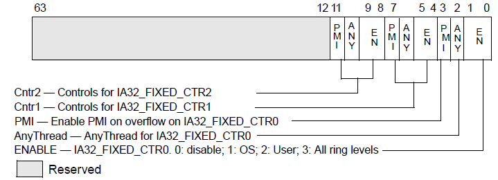
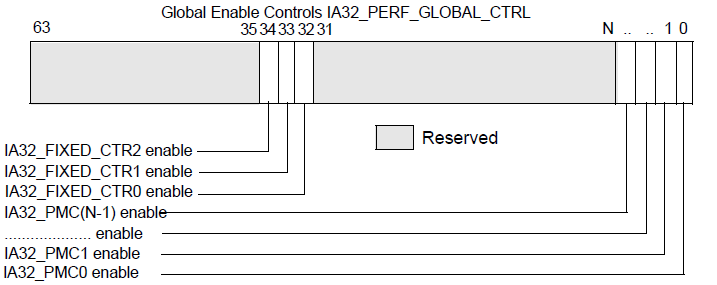
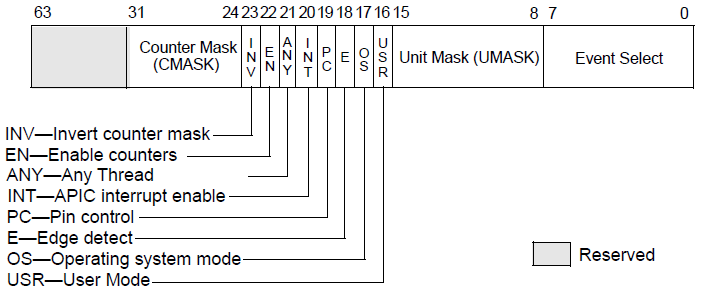
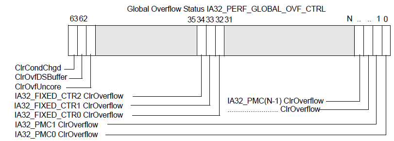
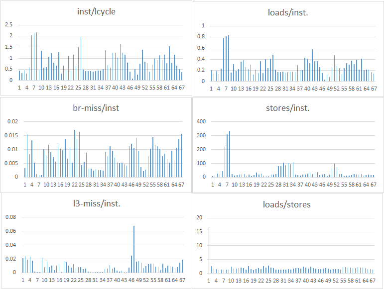
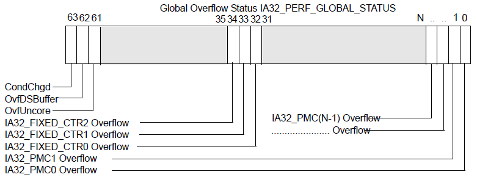

Tutorial on Hardware Performance Counters
===========

# Introduction
In this tutorial you will learn how to use hardware performance counters.

# Motivation
Let's suppose you wrote a program and it correctly achieved the specific goal (i.e., it computes the expected value). However, you noticed that its execution is far slower than one would expect. You’ve spent several agonizing hours looking over the source code, but you are unable to determine the root cause. To that end, you’ve decided you need to look more closely at the program’s runtime performance to see what the bottlenecks might be. 

```bash
  //--------Matrix multiplication------//
  int main()
  {
    int first[10][10], second[10][10], multiply[10][10];
    int m, n, p, q, c, d, k, sum;
    sum = 0, m = n = p = q = 10;

    for (c = 0; c < m; c++)
      for (d = 0; d < n; d++) {
          first[c][d]=2;
          second[d][c]=2;
        }
      for (c = 0; c < m; c++) {
        for (d = 0; d < q; d++) {
          for (k = 0; k < p; k++) {
            sum = sum + first[c][k]*second[k][d];
          }
          multiply[c][d] = sum;
          sum = 0;
        }
      }
      printf("Product of entered matrices:-\n");
      for (c = 0; c < m; c++) {
        for (d = 0; d < q; d++)
          printf("%d\t", multiply[d][c]);			
        printf("\n");
      }
    
    return 0;
  }
```

Luckily, you have taken some computer science courses before, and remembered that a basic metric for evaluating the performance of the program is instructions/cycle (IPC), i.e., how many instructions has been executed per CPU clock cycle. Thus, the task at hand is to obtain that measurement for your program. 

To obtain the no. of instructions and total cycles taken during execution, you can run it on the CPU simulator or use source/binary instrumentation technique. However, these tools do not provide an actual IPC measurement, as they are simulated environments. 

*So, how do you measure performance of program on a real hardware?*

Approach: Hardware performance counters (HPC) offer a solution.


# 1. Introduction to Hardware Performance Counter (HPC)

Modern processors (such as Intel, AMD) facilitates HPCs, which measure events related to -- instructions, memory and execution behavior on CPU pipeline. You can measure events -- such as instructions, cycles, cache (L1/L2) access, translation lookaside buffer access, main memory access -- during program execution. On Intel processor, this functional unit is named as Performance Monitoring Unit (PMU).

In this tutorial, we will use the code snippet from our HPC driver available at **[../drv/HPCTestDrv.c](../drv/HPCTestDrv.c)**

**Our objective: Obtain number of retired instructions and CPU cycles using HPCs to compute IPC** 

Intel processors provide 3 fixed counters, each of 48-bit, that measure the number of instructions, cycles per logical core and cycles per core, respectively. The measurements from these counters can allow us to compute the IPC. 

**Note:** Modern processor divides each physical core into two or more cores, a.k.a logical core, to maximize the utilization of the CPU pipeline, similar to the multithreading in software (called as **Hyperthreading** technology by Intel).

## I. How to obtain HPC data?

The basic idea is to configure HPCs before your program starts execution. Once your program terminates, you then read the counter data. 

### A. Configure HPC 
HPCs can be configured only in kernel mode. You can write a custom kernel driver in order to configure HPCs. HPCs can be configured by using model specific registers (MSRs). One can use specific Intel instructions, namely **wrmsr** and **rdmsr** to write and read MSRs, respectively. We can also use a wrapper in the usermode, which can initialize and unload the kernel driver. 

In this tutorial we will refer to kernel functions WriteMSR and ReadMSR that are defined below:

```bash
  /*
  * Write into MSR registers
  */
  void WriteMSR(int lowVal, int highVal, int addr){
    __asm{
      mov eax, lowVal
      mov edx, highVal
      mov ecx, addr
      wrmsr
    }
  }

  WriteMSR(0x0000022A, 0x00000000, 0x38D);
```

```bash
  /*
  * Read MSR registers
  */
  INT64 ReadMSR(int addr){
    int lowVal = 0, highVal = 0; 
    INT64 combinedVal = 0;
    
    __asm{
      mov ecx, addr
      rdmsr
      mov lowVal, eax
      mov highVal, edx
    }
    combinedVal = Extract48BitVal(lowVal, highVal);
    return combinedVal;
  }

  INT64 combinedVal = ReadMSR(addr);
```
The **rdmsr** and **wrmsr** assembly instructions use the value in the register ecx to specify which MSR to access. Since the MSRs are 64-bit long we need to use two 32 bit registers (namely eax and edx) to load/store the lower and higher bits of the MSR.

HPCs can be configured in three steps (as per Chapter 18 of Intel SDM):

#### 1. Configure fixed counters via IA32_FIXED_CTR_CTRL MSR (0x38D)
  - Assign ‘1’ to bits 1, 5 & 9 to enable 3 fixed counters (CTR0, CTR1, CTR2) to count events in usermode only, otherwise ‘0’

<p></p> 

```bash
  WriteMSR(0x0000022A, 0x00000000, 0x38D);
```

#### 2. Enable all fixed counters via IA32_PERF_GLOBAL_CTRL MSR (0x38F)
  - Set bits corresponding to fixed counter to ‘1’, otherwise ‘0’. 

<p></p> 

```bash
  WriteMSR(0x0000000F, 0x00000007, 0x38F);
```

#### 3. Zero out the counters to clear any previous values 
  - You need to zero out the counters during configuration to collect accurate measurement. To zero out a counter write a value 0 to its address.

```bash
  WriteMSR(0x00000000, 0x00000000, 0x309);
```

### B. Read HPC data
- Once the program terminates the execution, you need to obtain counter data.

- To read the performance counter values we use the kernel function ReadMSR. It reads the value of MSR specified by the address.
  - Fixed counter addresses (addr) -- 0x309, 0x30A, 0x30B
  - Execute **rdmsr** instruction.
  - 48-bit counter data is collected in edx:eax registers (higher 16-bits in edx and lower 32-bits in eax register).  

```bash
  INT64 combinedVal = ReadMSR(addr);
```

Finally, you can calculate instructions/cycles (IPC) of your program by using HPC data as follows:  

```bash
  1. Execute wrapper program 
    - Configures the HPC counters at the driver startup
  2. Run your program (e.g., matrix multiplication)
  3. Stop the wrapper program
    - Stops the HPC driver and outputs the HPC data
```

## II. Tutorial 1 :computer:
- The test program (i.e., matrix multiplication) is shown in [./test.c](./test.c), which is instrumented with “int 2e”. Compile it using C compiler.
- Configure and build HPC driver in **POLLING** mode by following the steps in [README.md](../README.md). 
- Estimate IPC for your test program using the count of instructions and cycles. 

### Findings :bulb:
- For my program, IPC = 0.781, with no. of instructions = 7348872, logical cycles = 9402846, core cycles = 8634600. 
- What is the IPC measurement in your case? Why is IPC low in my program? Generally, modern processors have high IPC > 1.

### Discussion :thought_balloon:
- How can we get more information about our program to find the reason for low performance? Can we monitor other parameters too?
- Why is logical cycle and core cycle values different, though our VM has only one logical core? 
- Does each run have same counter values?
- Why each run has different counter values for the same test program?
- Is the counter data only related to our test program?
- What are the sources of noise?
- How can we obtain counter data per-process?


# 2. Programmable Monitoring Counters (PMCs)
In the previous section, we learned how to monitor instructions and CPU cycles using HPCs. Instruction per cycle metric gives an idea of how our program performs on the hardware during execution. Still, we  want to learn more about the execution behavior. For example, we need to know if the program exhibits memory accesses, cache misses, branch mispredictions in an abnormal way. Those are costly operations and understanding their behavior can yield deeper insights on the root cause of program's poor performance.

**Our objective: Understand how to measure cache, memory, branch related events during execution.**

*Approach:* Performance Monitoring Unit (PMU) in Intel CPU allows monitoring of events related to CPU microarchitecture -- such as branch, caches, memory, translation lookaside buffers. There are 100s of such events. In addition to 3 fixed counters that we used in the previous part, PMU provides 4 programmable counters (PMCs) to monitor 4 additional events. The events that have to be monitored are selected using MSRs. A comprehensive list of the performance monitoring events is listed in the [Chapter 19 of Intel's Software Developer's Manual (SDM)]((https://www.intel.com/content/dam/www/public/us/en/documents/manuals/64-ia-32-architectures-software-developer-vol-3a-part-1-manual.pdf)). Next we will use PMCs to monitor these events.

## I. How to obtain PMC data?

Similar to fixed performance counters, we configure PMCs by using MSRs. 

### A. Configure PMC
  - Follow the steps below to configure PMCs:

#### 1. Configure PMCs via IA32_PERFEVTSELx MSRs
  - Event and its unit mask can be obtained from Chapter 19 of Intel SDM
  - Set bit 16 to ‘1’ to count only in usermode
  - Set bit 22 to ‘1’ to enable the counter
  - Set other bits to ‘0’
  - Use ecx to assign the address of IA32_PERFEVTSELx  MSR
    - Addresses are: 0x186, 0x187, 0x188, 0x189 (see Chapter 35 of Intel SDM)
  
<p></p> 

  Here we aim to monitor following events -- branch misprediction, cache miss (L3 cache), no. of load and no. of store operations.

```bash
  //Configure HPC events to monitor userspace events
  #define EVENT0	0x004100C5    //Number of mispredicted branch instructions
  #define EVENT1	0x004101C2    //Number of L3 cache miss
  #define EVENT2	0x004181D0    //Number of load operations
  #define EVENT3	0x004182D0    //Number of store operations
    
  WriteMSR(EVENT0, 0x00000000, 0x186);
  WriteMSR(EVENT1, 0x00000000, 0x187);
  WriteMSR(EVENT2, 0x00000000, 0x188);
  WriteMSR(EVENT3, 0x00000000, 0x189);
```

#### 2. Zero out the counter values
  - Address of PMCs: 0xC1, 0xC2, 0xC3, 0xC4

```bash
  WriteMSR(0x00000000, 0x00000000, 0xC1);
  WriteMSR(0x00000000, 0x00000000, 0xC2);
  WriteMSR(0x00000000, 0x00000000, 0xC3);
  WriteMSR(0x00000000, 0x00000000, 0xC4);
```

#### 3. Enable all PMCs via IA32_PERF_GLOBAL_CTRL MSR (0x38F)
  - Set bits corresponding to PMCs to ‘1’, otherwise ‘0’. 
  - Use ecx register to write address of MSR (0x38F).

<p></p> 

```bash
  WriteMSR(0x0000000F, 0x00000007, 0x38F);
```

### B. Read PMC data
  - After the program completes the execution, you need to obtain PMC data.
  - Follow the steps below:
    - Use ecx register to set the address for the corresponding fixed counter
      - PMC addresses (addr) -- 0xC1, 0xC2, 0xC3, 0xC4
    - Execute **rdmsr** instruction.
    - 48-bit counter data is collected in **edx:eax** register 

```bash
  INT64 combinedVal = ReadMSR(addr); 
```

You can run your program as stated below:  
```bash
  1. Execute wrapper program 
    - Configures the HPC counters at the driver initialization
  2. Run your program (e.g., matrix multiplication)
  3. Stop the wrapper program
    - Stops the HPC driver and outputs the HPC data
```

## II. Tutorial 2 :computer:
In this tutorial, we aim to obtain PMC counter data, in addition to the fixed counter data. As discussed above, we will use PMC counters to monitor 4 events -- branch misprediction, L3 cache miss, no. of loads and no. of stores. 
- Configure and build your HPC driver in **POLLING** mode (follow steps in [README.md](../README.md)).
- Run the test program, i.e., matrix multiplication.
- Observe the events. 

### Findings :bulb:
- For my program, the counter values are as follows:
  - Inst. = 9233128, logical cycles = 10451837, core cycles = 9527850 
  - Branch miss = 50525, L3 cache miss = 167232, 
  - Loads = 2736803, Stores = 1437746

- Hey, we obtained PMC data, let's discuss some of the parameters from our result. 
  - IPC (inst./logical cycles) = **0.883**
  - Branch miss rate (Branch miss/ Inst.) = 0.547%
  - L3 cache miss rate (L3 cache miss/Inst.) = **1.811%**
  - Loads/Inst. = **29.641%**
  - Stores/Inst. = 15.571%
  - Loads/Stores = **1.9035**

So, what do the highlighted numbers reveal? 
- IPC - overall execution seems a slower.
- Loads and store values show that there are more memory operations. 
- More load operations have been executed than the store operations. 

### Assignment :notebook:
We have several other events related to memory load operation: 
- mem_load_retired.l1_hit, mem_load_retired.l2_hit, mem_load_retired.l3_hit
- mem_load_retired.l1_miss, mem_load_retired.l2_miss, mem_load_retired.l3_miss
- mem_load_retired.fb_hit 

**Which event will you choose for evaluating the performance? :pensive:** 

### Discussion :thought_balloon:
We understood that our program has slower executions. There are many memory operations executed. 
1. Is the L3 cache miss value normal? 
2. Here, we lack the information about which part of the program has a low performance? 

# 3. Programmable Monitoring Interrupt (PMI)
So far we learned how to monitor and measure events using fixed and programmable counters. Using these counters, we can gain various information about the overall execution behavior of the program on CPU. However, as discussed above, by learning the overall program behavior, we cannot precisely determine which part of the program has a low performance. In order to gain this knowledge, we must be able to sample the events for each window (of certain length) during the program execution. In other words, we must be able to record the HPC data for each window during execution.   

**How to monitor events at a fine-grained level using HPCs?**
  - Well, PMU has a solution -- Performance Monitoring Interrupt (PMI). PMU allows fixed and programmable counters to generate PMI for a preset threshold value. So, we can generate a PMI for a window size, which is determined by a threshold limit preset on that counter. For example, we can monitor events for each 512,000 retired instructions during the execution. This will help us to understand which window has a slow performance, i.e., higher memory access or branch misses or memory operations.

## I. How to obtain HPC data using PMI?
  - First, we need to set a threshold limit on a counter to generate a PMI. At each PMI, we need to reset the threshold values to continue generating PMI. 

### A. PMI Configuration
  - Follow the steps below to configure PMI:

#### 1. Configure counter for PMI 
  - Enable PMI on CTR0 via IA32_FIXED_CTR_CTRL MSR (0x38D) 
  - Assign ‘1’ to bit 3 to enable PMI on fixed counter CTR0
  - Assign ‘1’ to bits 1, 5 & 9 to enable 3 fixed counters (CTR0, CTR1, CTR2) to count events in usermode only, otherwise ‘0’

<p></p> 

```bash
  WriteMSR(0x0000022A, 0x00000000, 0x38D);
```
#### 2. Configure programmable counters as stated in Section [1-I.A](#a-configure-hpc)

#### 3. Set a threshold value for a counter 
  - Select fixed counter0 (CTR0) to generate PMI, for every 512,000 instructions retired
  - Set threshold value = - 512000 on CTR0 as:

```bash
  INT32 pmiThreshold = -512000;

  WriteMSR(pmiThreshold, 0x0000FFFF, 0x309);
``` 
#### 4. Zero out the counters 

#### 5. Enable the counters via IA32_PERF_GLOBAL_CTRL MSR (0x38F)
  - Set bits corresponding to the counters to ‘1’, otherwise ‘0’. 

<p></p> 

```bash
    WriteMSR(0x0000000F, 0x00000007, 0x38F);
```

### B. Read and reset MSRs at PMI
  - Follow the steps below to collect data and reset MSRs:

#### 1. Read counter data 
- Read the values of the fixed and programmable counters:
  - Fixed counters MSRs -- 0x309, 0x30A, 0x30B
  - Programmable counter MSRs -- 0xC1, 0xC2, 0xC3, 0xC4

```bash
  INT64 combinedVal = ReadMSR(addr);
```

#### 2. Reset the threshold value and zero out counters as done in Section [3-I.A.3](#3-set-a-threshold-value-for-a-counter) and [3-I.A.4](#4-zero-out-the-counters)
  - Clear the overflow flag via IA32_PERF_GLOBAL_OVF_CTRL MSR (0x390)
  - Clear overflow on CTR0 to continue monitoring -- set bit 32 to ‘1’

<p></p> 

```bash
  WriteMSR(0x00000000, 0x00000001, 0x390);
```

## II. Tutorial 3 :computer:
- In this tutorial, we aim to obtain PMC counter data, in addition to the fixed counter data. As discussed above, we will use PMC counters to monitor 4 events -- branch misprediction, L3 cache miss, no. of loads and no. of stores. 
  - Configure and build your HPC driver in the **SAMPLING** mode by following the instruction in [README.md](../README.md).
  - Run the test program (i.e., matrix multiplication).
  - Observe the events.
  - Plot the graph.

### Findings :bulb:
- I plotted the graph for the parameters we observed in Tutorial 3. My test program shows following graph. 

<p></p> 

Can we understand the performance behavior from these graphs?
- From the graphs, it is not evident the exact window where the performance is low. Because this example (matrix multiplication) does not have terribly bad performance. However, using this example, we learnt how to use the HPCs. :smile:

### Assignment :notebook:
- Can we observe the behavior for other events?

### Discussion :thought_balloon:
- How can we obtain counter data per-process?
  - We monitor context switch to save the HPC values for a process.

## III. Frequently Asked Questions :question:

1. Can we generate PMI on multiple counters? 
  - Yes we can generate PMI for more than one counter. We can follow the configuration steps similar to PMI Configuration.

2. How to check which counter triggered the PMI? Is it necessary to check?
  - We can read IA32_PERF_GLOBAL_STATUS MSR to check which counter triggered the PMI. When the counter reaches the preset threshold value, overflow occurs and the corresponding bit in this MSR is set to ‘1’. At each PMI, we can check this MSR so that we can perform different operations for different counter overflows.

**Check overflow status at each PMI**
- via IA32_PERF_GLOBAL_STATUS MSR (0x38E)
- when overflow occurs corresponding counter bit is 1 

<p></p> 

```bash
  INT64 combinedVal = ReadMSR(addr);
```

## Recommended Readings: :books:
- Intel Software Developer's Manual Chapter 18: Performance Monitoring  (https://www.intel.com/content/dam/www/public/us/en/documents/manuals/64-ia-32-architectures-software-developer-vol-3a-part-1-manual.pdf).
- Intel Software Developer's Manual Chapter 19: Performance-Monitoring Events (https://www.intel.com/content/dam/www/public/us/en/documents/manuals/64-ia-32-architectures-software-developer-vol-3a-part-1-manual.pdf).
- Intel Software Developer's Manual Chapter 35: Model-Specific Registers (MSRs) (https://www.intel.com/content/dam/www/public/us/en/documents/manuals/64-ia-32-architectures-software-developer-vol-3a-part-1-manual.pdf).
- Tutorial - Linux kernel profiling with perf [https://perf.wiki.kernel.org/index.php/Tutorial](https://perf.wiki.kernel.org/index.php/Tutorial)
- Computer Architecture: A Quantitative Approach. David Patterson, John L. Hennessy

Cite as: :star:
--------------------------------
**If you use this tool, please cite as:**

*Das, S., Werner, J., Antonakakis, M., Polychronakis, M. and Monrose, F., 2019, May. SoK: The Challenges, Pitfalls, and Perils of Using Hardware Performance Counters for Security. To appear in Proceedings of the 40th IEEE Symposium on Security and Privacy (S&P).*
